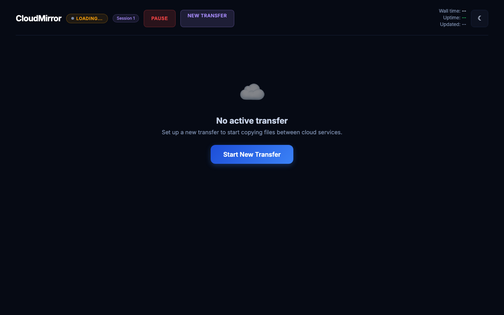
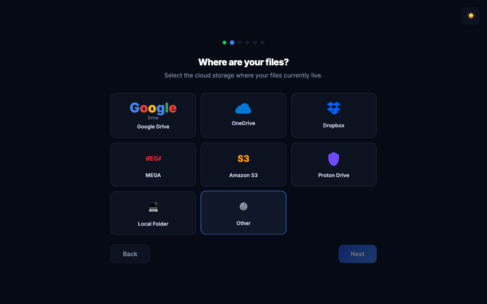

[](https://www.python.org/downloads/)
[](LICENSE)
[](https://pypi.org/project/cloudhop/)
[](https://github.com/husamsoboh-cyber/cloudhop)
[](https://github.com/husamsoboh-cyber/cloudhop/actions/workflows/tests.yml)

# CloudHop

**The easiest way to copy files between cloud storage services. Free, open source, runs on your machine.**



## Download / Install

**Mac** -- Download `CloudHop.dmg` from [Releases](https://github.com/husamsoboh-cyber/cloudhop/releases)

First launch: right-click > Open > click "Open" ([why?](https://support.apple.com/en-us/102445))

**Windows** -- Download `CloudHop-windows.zip` from [Releases](https://github.com/husamsoboh-cyber/cloudhop/releases)

**pip**
```bash
pip install cloudhop && cloudhop
```

**Homebrew**
```bash
brew tap husamsoboh-cyber/tap && brew install cloudhop
```

**From source**
```bash
git clone https://github.com/husamsoboh-cyber/cloudhop && cd cloudhop && pip install -e . && cloudhop
```

## Why CloudHop?

- Free and open source, no limits, no account needed
- Files transfer directly, never touch our servers
- 70+ cloud providers (Google Drive, OneDrive, Dropbox, iCloud, MEGA, S3, Proton Drive...)
- Visual wizard, no command line needed
- Pause, resume, and schedule transfers across restarts
- Copy, sync, or two-way bisync modes

## How it works

1. **Run CloudHop** -- launch the app or run `cloudhop` in a terminal
2. **Pick source** -- choose where your files are (e.g., OneDrive)
3. **Pick destination** -- choose where to copy them (e.g., Google Drive)
4. **Configure options** -- set parallel transfers, exclude folders, limit bandwidth
5. **Connect accounts** -- authorize each cloud provider in your browser
6. **Start transfer** -- watch progress in the live dashboard with speed charts and ETA

## Features

#### Transfer

- Copy, sync, or two-way bisync modes with safety warnings for destructive operations
- Pause, resume, and cancel active transfers
- Multi-destination transfers -- copy one source to up to 5 destinations via queue
- Transfer presets -- save, manage, and re-run configurations with one click
- Selective copy -- browse and pick specific folders to transfer
- Exclude folder picker -- visually exclude folders before starting
- Server-side copy where the provider supports it (no local disk needed)
- Conflict resolution via checksum verification option
- Dry-run preview showing file count and total size before starting
- Transfer receipt -- downloadable summary after completion
- Post-transfer verification via rclone check

#### Dashboard

- Real-time progress with live speed and file count charts
- ETA calculation with smoothing
- File type breakdown by extension
- Active transfer list showing files in progress
- Recent files feed
- Error tracking with user-friendly messages
- Progress percentage in browser tab title
- Milestone notifications at 25%, 50%, 75%
- Completion screen with verify and receipt options
- Connection-lost banner when the server is unreachable

#### Scheduling & Bandwidth

- Schedule windows with start/end times in HH:MM format
- Day-of-week selection for recurring schedules
- Live bandwidth control during transfers
- Bandwidth limit presets in the wizard (10M, 1G, 500K, etc.)
- Auto-pause on battery (macOS)

#### Notifications

- Desktop notifications on macOS and Linux
- Email notifications on completion and failure via SMTP
- Browser milestone alerts at 25%, 50%, 75%
- Sound alert on completion with mute option

#### Settings

- Settings page with dark/light theme toggle and system color-scheme detection
- SMTP configuration for email notifications with test email button

#### Security

- Localhost-only binding -- not accessible from other machines
- CSRF protection with double-submit token pattern and timing-safe comparison
- DNS rebinding protection via Host header validation
- Input validation on all API endpoints
- Path traversal prevention using realpath with os.sep checks
- SSRF prevention -- rejects rclone on-the-fly backend specifiers
- Credential filtering -- masks 18 sensitive flag patterns in logs and UI

#### AI Integration

- [CloudHop MCP](https://github.com/husamsoboh-cyber/cloudhop-mcp) connects CloudHop to Claude, letting you control transfers through natural language
- "Copy my OneDrive photos to Google Drive" -- just say what you need
- Preview sizes, start transfers, monitor progress, pause and resume, all from a conversation
- Works with Claude Code and Claude Desktop

## CLI Usage

```bash
# Interactive wizard
cloudhop

# Direct transfer
cloudhop onedrive: gdrive:backup --transfers=8 --bwlimit=10M

# Subcommands
cloudhop status
cloudhop pause
cloudhop resume
cloudhop history
```

## Supported Providers

Google Drive, OneDrive, Dropbox, iCloud Drive, MEGA, Amazon S3, Proton Drive, Local Folder + 70 more via rclone

## How is this different from...

**rclone?**
CloudHop uses rclone as its engine. If you're comfortable with CLI, you don't need this. CloudHop adds a visual wizard and live dashboard.

**MultCloud / CloudFuze?**
Those are paid SaaS that route files through their servers. CloudHop is free and your files transfer directly between providers.

**Download and re-upload?**
That requires local disk space and 2x transfer time. CloudHop uses server-side copy where supported.

## The story

I needed to move 500GB of files from OneDrive to Google Drive. Every tool I found was either paid, required uploading my files to someone else's server, or needed a PhD in command-line tools. So I built CloudHop -- a simple, visual way to move files between any cloud service, running entirely on your own computer. No accounts, no subscriptions, no middleman.

## Screenshots

| Wizard Welcome | Source Selection | Dashboard |
|:-:|:-:|:-:|
|  |  |  |

## Support

CloudHop is free and open source. If it saves you time, consider supporting development:

[Sponsor on GitHub](https://github.com/sponsors/husamsoboh-cyber) | [Buy Me a Coffee](https://buymeacoffee.com/husamsoboh)

### Sponsors
<!-- $100/month sponsors: large logo with link -->
*Become the first sponsor! Your logo will appear here.*

### Backers
<!-- $25/month backers: name or small logo -->
*Become a backer! Your name will appear here.*

### Supporters
<!-- $3-$10/month supporters: name with optional link -->
*Support CloudHop and see your name here.*

## Links

[Security](SECURITY.md) | [Privacy](PRIVACY.md) | [Contributing](CONTRIBUTING.md) | [Changelog](CHANGELOG.md)

## License

MIT License -- see [LICENSE](LICENSE) for details.
