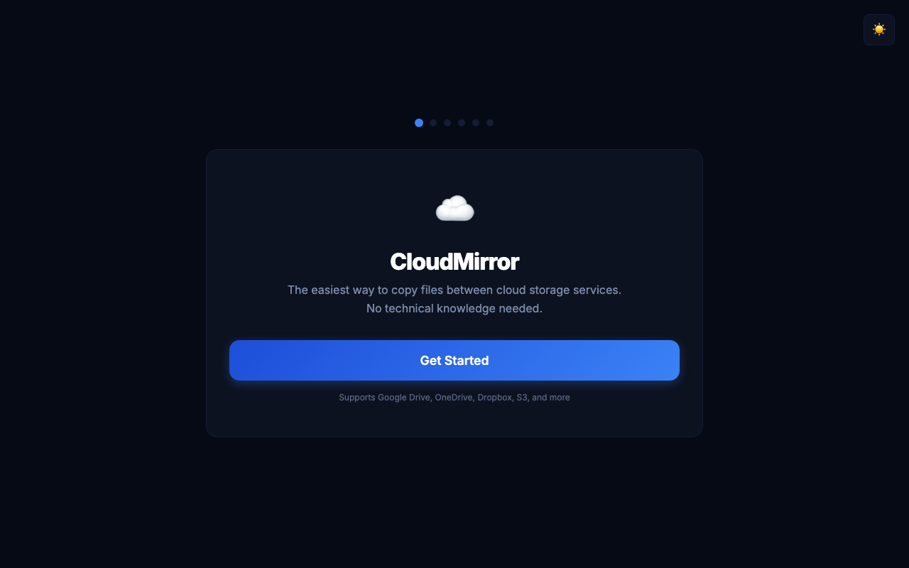

# CloudMirror

The easiest way to copy files between cloud storage services.
No technical knowledge needed -- just run and follow the prompts.




## Features

- **Web-based setup wizard** -- no command line needed after launch
- **Real-time transfer dashboard** with speed charts, progress bars, and ETA
- **Pause/resume transfers** -- close and re-run to pick up where you left off
- **Session tracking** across restarts, with downtime detection
- **Dark and light themes** with one-click toggle
- **Sound notification** when transfer completes
- **Single Python file** -- no dependencies beyond Python 3.7+
- Installs rclone automatically if missing

## Supported Services

| Provider       | Type           | Notes                              |
|----------------|----------------|------------------------------------|
| Google Drive   | Cloud storage  | Browser-based OAuth login          |
| OneDrive       | Cloud storage  | Browser-based OAuth login          |
| Dropbox        | Cloud storage  | Browser-based OAuth login          |
| MEGA           | Cloud storage  | Username/password                  |
| Amazon S3      | Object storage | Access key + secret                |
| Proton Drive   | Cloud storage  | Username/password                  |
| Local folder   | Local disk     | Any path on your computer          |
| Other          | Advanced       | Any rclone-supported backend       |

## Quick Start

```bash
curl -O https://raw.githubusercontent.com/husamsoboh-cyber/cloudmirror/main/cloudmirror.py
python3 cloudmirror.py
```

That's it. A browser window opens with the setup wizard.

## How It Works

1. **Run** `python3 cloudmirror.py` -- CloudMirror starts a local web server and opens your browser.
2. **Choose source** -- pick where your files are (e.g., OneDrive).
3. **Choose destination** -- pick where to copy them (e.g., Google Drive).
4. **Log in** -- a browser tab opens for each service so you can authorize access. No passwords are stored by CloudMirror.
5. **Configure** -- optionally set number of parallel transfers and exclude folders.
6. **Transfer** -- watch progress in the live dashboard with speed charts, file counts, and ETA.

If you close CloudMirror mid-transfer, just run it again. It resumes automatically.

## Live Dashboard

The dashboard (at `http://localhost:8787/dashboard`) shows:

- Overall progress with percentage and ETA
- Transfer speed (current, average, peak) with live chart
- Active file transfers in progress
- Recently copied files
- Session history with pause/resume tracking
- Downtime gaps between sessions
- File type breakdown
- Error tracking

## Advanced Usage (CLI)

Power users can skip the wizard and pass rclone arguments directly:

```bash
# OneDrive to Google Drive with 8 parallel transfers
python3 cloudmirror.py onedrive: gdrive:backup --transfers=8

# Local folder to Dropbox
python3 cloudmirror.py /local/folder dropbox:backup --transfers=4

# S3 bucket to Google Drive
python3 cloudmirror.py s3:mybucket gdrive:archive --transfers=16
```

CloudMirror passes these arguments to rclone and opens the live dashboard.

## Requirements

- Python 3.7+
- rclone (auto-installed if missing)
- A modern web browser (for the wizard and dashboard)
- No other dependencies

## FAQ

**Do I need to install anything besides Python?**
No. CloudMirror installs rclone automatically if it is not already on your system.

**Is it safe?**
Yes. CloudMirror runs entirely on your computer. Your files transfer directly between cloud services -- nothing passes through any third-party server. The web interface binds to localhost only, so no one else on your network can access it.

**Can I pause and resume?**
Yes. Use the Pause/Resume buttons in the dashboard, or close CloudMirror and run it again later. It picks up where it left off and tracks session history.

**What if my internet disconnects?**
Run CloudMirror again. rclone resumes the transfer automatically, skipping files already copied.

**Can I copy between two accounts on the same service?**
Yes, but CloudMirror will show a warning since it requires careful remote naming to avoid confusion.

**Does it work on Windows?**
Python and rclone both support Windows, but automatic rclone installation is only available on macOS and Linux. On Windows, install rclone manually first.

**Where are logs stored?**
Transfer logs are written to `~/.cloudmirror/cloudmirror_<id>.log`. State is saved to `~/.cloudmirror/cloudmirror_<id>_state.json`.

## Security

- The web server binds to **127.0.0.1 only** -- it is not accessible from other machines.
- CORS is restricted to localhost origins.
- Request body size is capped at 10 KB to prevent abuse.
- All user input is validated to prevent rclone flag injection.
- No data is sent to any external server (other than the cloud providers you choose).

## License

MIT License -- see [LICENSE](LICENSE) for details.
